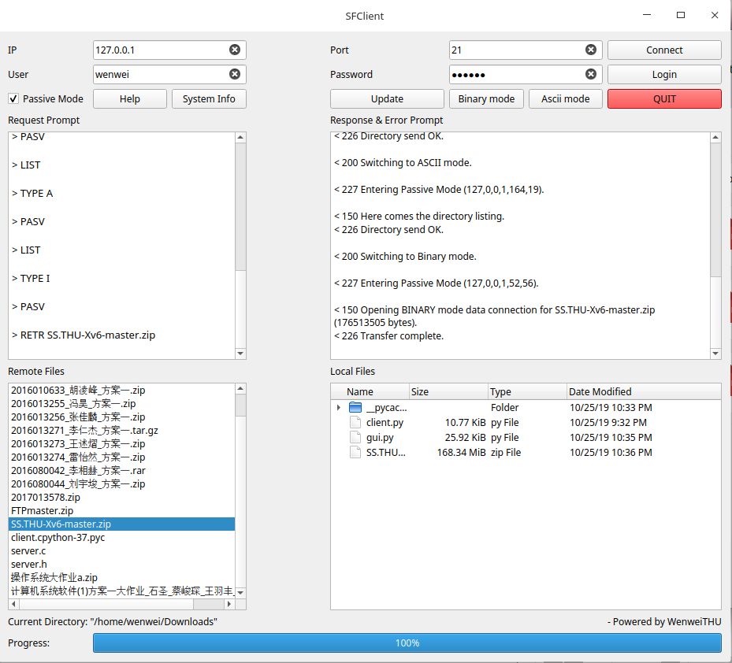

# SimpleFTP

## System

**Deepin 15.11** 

(Other system based on Linux kernel is okay, like Ubuntu 19.04)

 

## Programming Language

**Python3**

 

## Requirement

* PyQt5                                                         

```
pip install PyQt5
```

 

## Start

```
python gui.py
```


## Demo



Click **Help** button for more details.

